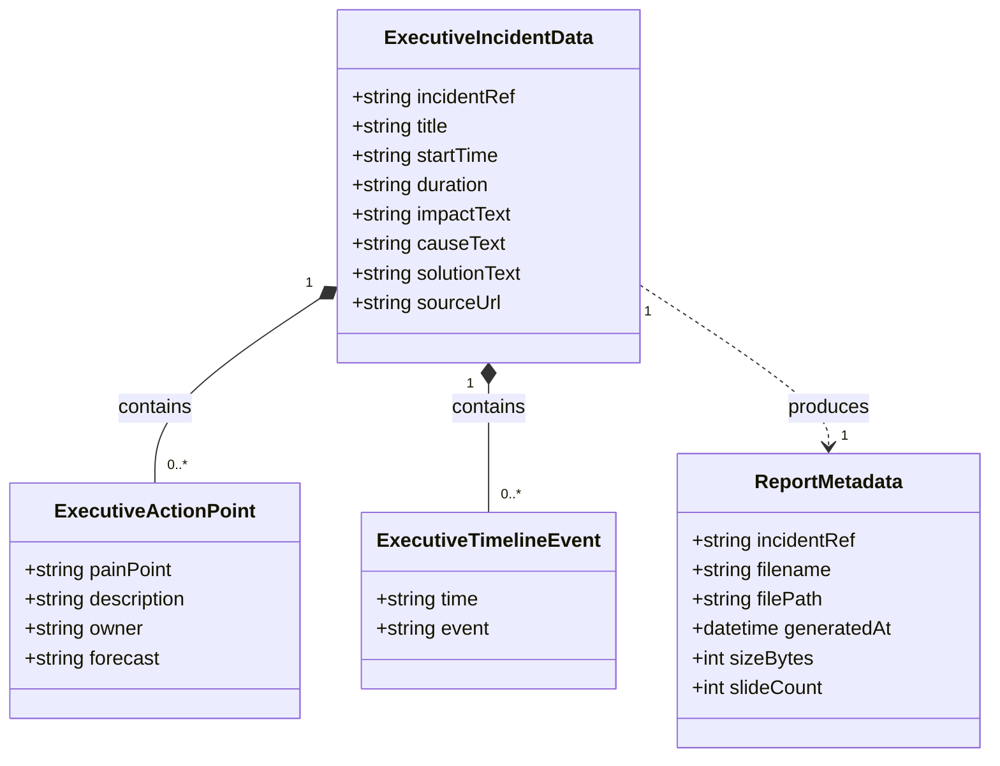

# Data Model: Informe Ejecutivo de Incidencias Postmortem (010-incident-executive-report)

**Feature**: `010-incident-executive-report`
**Date**: 2026-10-06

---

## 1. Entidades Principales

### 1.1 `ExecutiveIncidentData` (Modelo del Postmortem Procesado)

Representa los datos estructurados extraídos de la página de Confluence o suministrados por el operador para confeccionar la presentación ejecutiva.

| Campo | Tipo | Requerido | Descripción | Ejemplo |
|---|---|---|---|---|
| `incidentRef` | `string` | Sí | Identificador canónico de la incidencia / Trouble Ticket (TT) | `"2606S77393"` o `"INC000004141215"` |
| `title` | `string` | Sí | Título descriptivo de la incidencia | `"Problema de llamadas numeros IVRs de ATC exMM"` |
| `startTime` | `string` | Sí | Fecha y hora de inicio de la incidencia | `"09/06/2026 14:45:00"` |
| `duration` | `string` | Sí | Duración total calculada o documentada | `"3h 25m"` |
| `impactText` | `string` | Sí | Síntesis del impacto en servicio, negocio o clientes | `"Se produjo una degradación progresiva del servicio de voz..."` |
| `causeText` | `string` | Sí | Causa raíz técnica identificada | `"Saturación del límite de conexiones/prefijos BGP..."` |
| `solutionText` | `string` | Sí | Acciones correctivas aplicadas para resolver la incidencia | `"Tras la revisión por parte del TMC IP, se aumenta el límite..."` |
| `actionPoints` | `Array<ExecutiveActionPoint>` | Sí | Lista de puntos de acción relevantes | Ver sección 1.2 |
| `timelineEvents` | `Array<ExecutiveTimelineEvent>` | Sí | Hitos cronológicos de la incidencia | Ver sección 1.3 |
| `sourceUrl` | `string` | No | URL de la página de Confluence de origen | `"https://confluence.si.orange.es/display/POSTMORTEM/..."` |

---

### 1.2 `ExecutiveActionPoint` (Punto de Acción Relevante)

Corresponde a una fila de la tabla de la Diapositiva 1 (`PUNTOS DE ACCION RELEVANTES`).

| Campo | Tipo | Requerido | Descripción | Ejemplo |
|---|---|---|---|---|
| `painPoint` | `string` | Sí | Categoría o tipo del punto de acción | `"Solución"`, `"Detección"`, `"Otros"` |
| `description` | `string` | Sí | Descripción de la acción preventiva o correctiva | `"Ampliación prefix-BGP para servicio AWS"` |
| `owner` | `string` | Sí | Responsable o equipo asignado | `"TMC Acceso_Fijo"`, `"TMC Core_CS"` |
| `forecast` | `string` | Sí | Fecha estimada o estado de cierre | `"Cerrado"`, `"W26"`, `"10-jun"` |

---

### 1.3 `ExecutiveTimelineEvent` (Hito Cronológico)

Corresponde a una fila de la tabla de las Diapositivas 2 y 3 (`CRONOLOGÍA`).

| Campo | Tipo | Requerido | Descripción | Ejemplo |
|---|---|---|---|---|
| `time` | `string` | Sí | Hora del evento (HH:MM o DD/MM HH:MM) | `"15:16"`, `"16:00"` |
| `event` | `string` | Sí | Descripción del hito, alerta, escalado o acción técnica | `"Se abre incidencia masiva SL1 y bridge con equipos técnicos."` |

---

### 1.4 `ReportMetadata` (Metadatos del Informe Generado)

Información de estado y persistencia del informe en disco.

| Campo | Tipo | Requerido | Descripción | Ejemplo |
|---|---|---|---|---|
| `incidentRef` | `string` | Sí | Identificador de la incidencia | `"2606S77393"` |
| `filename` | `string` | Sí | Nombre del archivo generado | `"RESUMEN_EJECUTIVO_2606S77393.pptx"` |
| `filePath` | `string` | Sí | Ruta relativa en el servidor | `"data/reports/executive/RESUMEN_EJECUTIVO_2606S77393.pptx"` |
| `generatedAt` | `string` (ISO 8601) | Sí | Fecha y hora de generación | `"2026-10-06T17:30:00Z"` |
| `sizeBytes` | `number` | Sí | Tamaño del archivo en bytes | `1749686` |
| `slideCount` | `number` | Sí | Número total de diapositivas | `3` |

---

## 2. Diagrama de Relaciones de Datos

---

## 3. Reglas de Validación y Transformación

1. **Normalización del Código de Incidencia (`incidentRef`)**:
   - Se limpian espacios y caracteres extraños. Si el usuario ingresa un código abreviado o numérico, se conserva la referencia formal (ej. `2606S77393` o `INC000004141215`).
2. **Longitud Máxima de Textos en Diapositiva 1**:
   - `impactText`, `causeText` y `solutionText` se truncan o resumen si exceden ~450 caracteres para evitar que desborden las cajas de texto de la plantilla.
3. **Distribución y Paginación de la Cronología**:
   - Diapositiva 2 aloja los primeros 18-20 eventos.
   - Diapositiva 3 aloja los siguientes 18-20 eventos.
   - Si existen más de 40 eventos, se generan diapositivas dinámicas adicionales clonando la estructura de la Diapositiva 3.
4. **Puntos de Acción**:
   - La tabla de la Diapositiva 1 admite hasta 6 filas de puntos de acción. Si hay más, las filas sobrantes se paginan o se registran en una diapositiva anexa sin deformar el slide de resumen.

